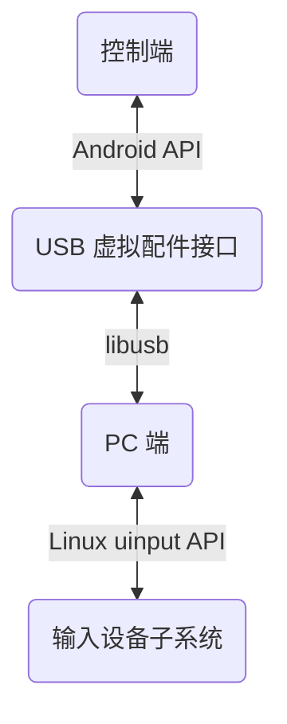
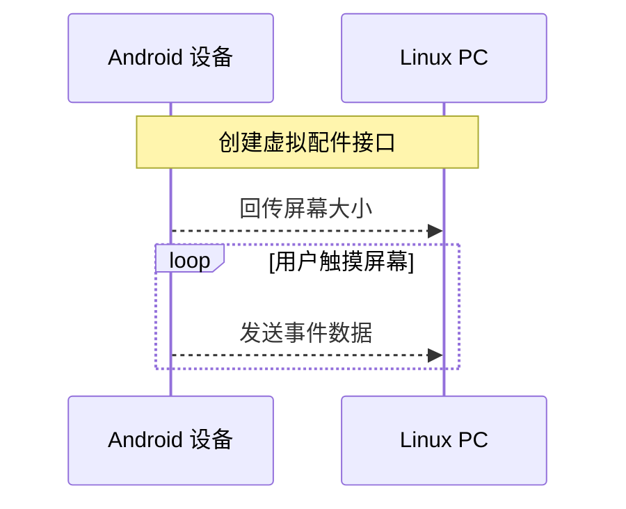

煤板子
=====

| [English](/README.md) |

用你的 Android 设备来控制 PC 上的 osu! 游戏

> [!Note]
>
> 注意：自用项目，因此目前仅支持 Linux PC 和 Android 14 以上的设备，欢迎贡献！

## 下载预构建

> [!NOTE]
>
> 注意：您仍需要从源码手动编译并安装 PC 端程序，请参考对应的 [README](/host-linux/README-chn.md)

[GitHub Releases](../../releases) 或者 [GitHub Actions](../../actions)

## 用法

1. 安装并打开 App，并通过 USB 连接设备至 PC

2. 启动 PC 端

3. 将主手指（用于模拟触控笔的手指）置于在设备屏幕上，并始终保持（在放入其他手指**之前**）

4. 使用主手指滑动来控制鼠标，用另外的两根手指来发送 X 和 Z 键

## 工作原理

<h6><em>项目架构</em></h6>

<h6><em>设备通信</em></h6>

## 编译

> [!WARNING]
>
> 警告：垃圾代码

请参考 [build.sh](build.sh.template)；本项目不使用 gradle, ndk-build 或者 Android Studio。

## 参考 / 鸣谢

[gibsson/linux-adk][gibsson/linux-adk]: For code demonstrating establishing USB acccessory interface and
working with AOA (Android Open Accessory) protocol using libusb

[androidvirtualpen][androidvirtualpen]: For inspiration and many reference of this project

[osu-droid][osudroid]: For idea of controlling osu! using just touchscreen

## 许可证

[GLWTPL](LICENSE-chn)

<!-- References: -->

[gibsson/linux-adk]: https://github.com/gibsson/linux-adk.git
[androidvirtualpen]: https://github.com/androidvirtualpen/virtualpen.git
[osudroid]: https://github.com/osudroid/osu-droid.git
