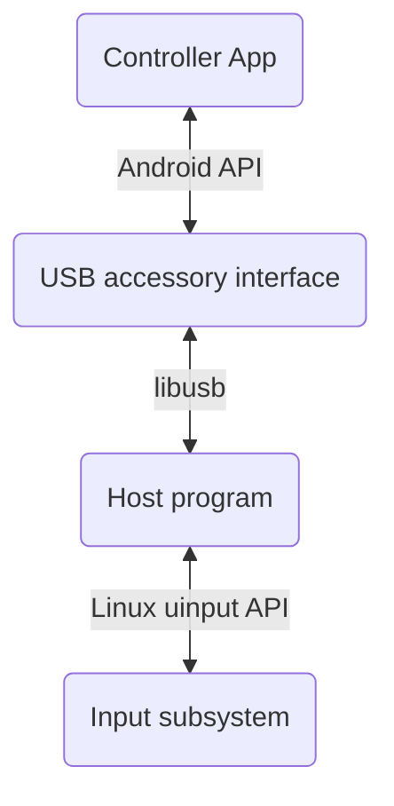
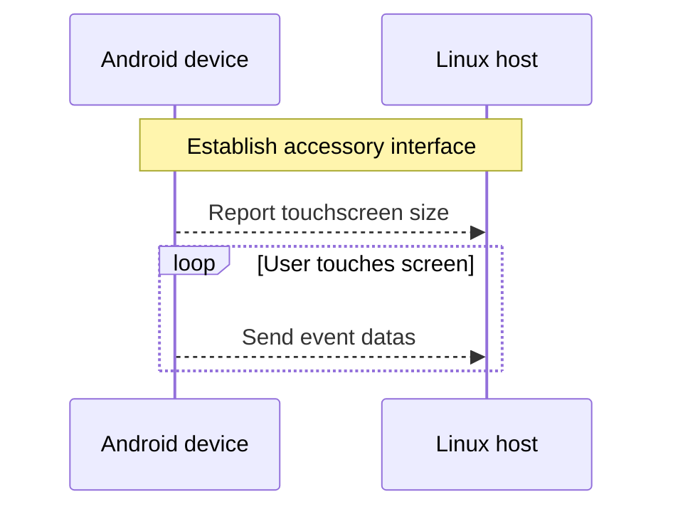

No Tablet Sar
=============

| [简体中文](/README-chn.md) |

This small application allows you to controll PC osu! game from an Android device

> [!Note]
>
> Since I made this for myself, currently only Linux hosts and Android 14 devices are supported. Contributions are welcome!

## Why⁇

*"No tablet sar"*

## Downloads

> [!NOTE]
>
> You will still need to build and install the host program manually, please refer to this [README](/host-linux/README.md).

[GitHub Releases](../../releases) or [GitHub Actions](../../actions)

## Usage

1. Install & open the controller app, connect your device to PC via USB

2. Start the host program

3. Put and keep your primary finger (for emulating pen) on your device, BEFORE other fingers

4. Use your primary finger to move the cursor, and use two of your other fingers for X and Z keys

## How it works

<h6><em>Project architecture</em></h6>

<h6><em>Device communications</em></h6>

## Build

> [!WARNING]
>
> Messy code

Please refer to [build.sh](build.sh.template); This project doesn't use gradle, ndk-build or Android Studio for build.

## Credits

[gibsson/linux-adk][gibsson/linux-adk]: For code demonstrating establishing USB acccessory interface and
working with AOA (Android Open Accessory) protocol using libusb

[androidvirtualpen][androidvirtualpen]: For inspiration and many reference of this project

[osu-droid][osudroid]: For idea of controlling osu! with just touchscreen

## License

[GLWTPL](LICENSE)

<!-- References: -->

[gibsson/linux-adk]: https://github.com/gibsson/linux-adk.git
[androidvirtualpen]: https://github.com/androidvirtualpen/virtualpen.git
[osudroid]: https://github.com/osudroid/osu-droid.git
